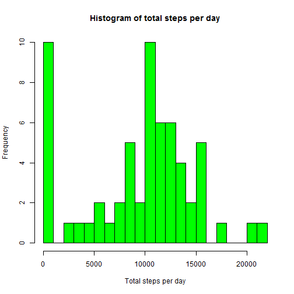
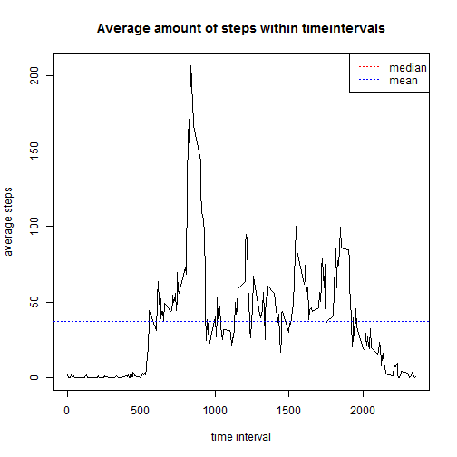
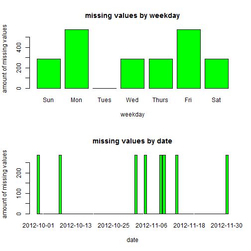
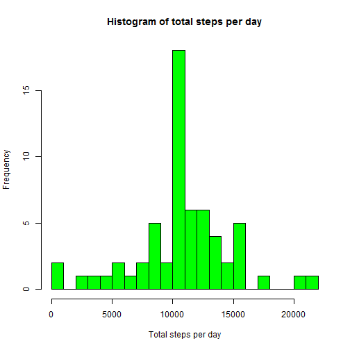
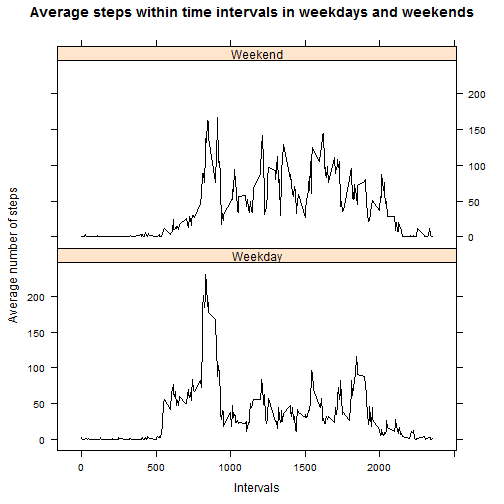

This document is made for Coursera - Reproducible Research course project 1. 
The purpose of this document is to excercise R markdown use and conducting brief data analysis.

First let´s load in the data and take a look what the data looks like


```r
data <- read.csv("activity.csv")
head(data)
```

```
##   steps       date interval
## 1    NA 2012-10-01        0
## 2    NA 2012-10-01        5
## 3    NA 2012-10-01       10
## 4    NA 2012-10-01       15
## 5    NA 2012-10-01       20
## 6    NA 2012-10-01       25
```

```r
str(data)
```

```
## 'data.frame':	17568 obs. of  3 variables:
##  $ steps   : int  NA NA NA NA NA NA NA NA NA NA ...
##  $ date    : Factor w/ 61 levels "2012-10-01","2012-10-02",..: 1 1 1 1 1 1 1 1 1 1 ...
##  $ interval: int  0 5 10 15 20 25 30 35 40 45 ...
```

We noticed that the data has 3 variables and 17568 observations. Also we can see that date is currently in factor format
so let´s make new variable dates and change date format using strptime() function and then checking that everything went as we expected.


```r
data$dates <- strptime(data$date, "%Y-%m-%d")
str(data)
```

```
## 'data.frame':	17568 obs. of  4 variables:
##  $ steps   : int  NA NA NA NA NA NA NA NA NA NA ...
##  $ date    : Factor w/ 61 levels "2012-10-01","2012-10-02",..: 1 1 1 1 1 1 1 1 1 1 ...
##  $ interval: int  0 5 10 15 20 25 30 35 40 45 ...
##  $ dates   : POSIXlt, format: "2012-10-01" "2012-10-01" ...
```

First we need to address the first question which has two parts:  
1. Make a histogram of the total number of steps taken each day

This requires us to first aggregate in daily level to see what are the daily total amoun of steps and then making the histogram.  
(Notice we remove the NA values from the aggregation)

```r
pd_data <- aggregate(data$steps, by=list(date=data$date), FUN=sum,na.rm=T)
hist(pd_data$x,col="green",breaks = 20,xlab="Total steps per day",main = "Histogram of total steps per day")
```

 

2.Calculate and report the **mean** and **median** total number of steps taken per day.  

```r
orig_mean <- mean(pd_data$x,na.rm=T)
orig_median <- median(pd_data$x,na.rm=T)
orig_mean
```

```
## [1] 9354.23
```

```r
orig_median
```

```
## [1] 10395
```

The second question has also two parts:

1. Make a time series plot (i.e. type = "l") of the 5-minute interval (x-axis) and the average number of steps taken, averaged across all days (y-axis)

To answer this we need to aggregate the data again this time by interval and then plot the aggregated data. We also added mean and median values across all timeintervals in order to get sense of average amount of daily steps taken.


```r
di_data <- aggregate(data$steps, by=list(interval = data$interval), FUN=mean,na.rm=T)
plot(di_data$interval,di_data$x,type="l",xlab="time interval",ylab = "average steps",main="Average amount of steps within timeintervals")
abline(h=median(di_data$x),col="red",lty=3)
abline(h=mean(di_data$x),col="blue",lty=3)
legend("topright", c("median","mean"),lty=c(3,3),col=c("red","blue"))
```

 

2. Which 5-minute interval, on average across all the days in the dataset, contains the maximum number of steps?


```r
di_data$interval[which.max(di_data$x)]
```

```
## [1] 835
```


Next task is to deal with the missing values in the data set, this section has 4 parts:

1. Calculate and report the total number of missing values in the dataset (i.e. the total number of rows with NAs)


```r
missing <- sum(is.na(data$steps))
perc <- round(missing/dim(data)[1]*100,2)
missing
```

```
## [1] 2304
```

```r
perc
```

```
## [1] 13.11
```
There are total of **2304** of missing values in the data set. Meaning **13.11** % missing values of the total data set.

2. Devise a strategy for filling in all of the missing values in the dataset. The strategy does not need to be sophisticated. For example, you could use the mean/median for that day, or the mean for that 5-minute interval, etc.

Let´s check where the NA values are located:


```r
par(mfrow=c(2,1))
library(lubridate)
loc_na <- data[which(is.na(data$steps)),]
loc_na$mis <- as.numeric(is.na(loc_na$steps))
loc_na$wday <- wday(loc_na$dates,label = T)
barplot(table(loc_na$mis, loc_na$wday),main="missing values by weekday",ylab="amount of missing values",xlab = "weekday",col="green")
barplot(table(loc_na$mis, loc_na$date),main="missing values by date",ylab="amount of missing values",xlab="date",col="green")
```

 

```r
par(mfrow=c(1,1))
```

By looking at the structure of the missing values we can conclude that it is mostly random there fore we can handle missing values by inputting mean value within corresponding time interval. This is also convinient as we have already calculated mean values per time interval in earlier step.

3. Create a new dataset that is equal to the original dataset but with the missing data filled in.


```r
mis_rows <- which(is.na(data$steps))
for(i in 1:length(mis_rows)){
  data$steps[mis_rows[i]] <- di_data[which(di_data$interval == data$interval[mis_rows[i]]),2]
}
```

Let´s check do we still have missing values in steps.

```r
sum(is.na(data$steps))
```

```
## [1] 0
```

As we can see, all missing values have been changed to the mean value of the time interval.

4. Make a histogram of the total number of steps taken each day and Calculate and report the mean and median total number of steps taken per day. Do these values differ from the estimates from the first part of the assignment? What is the impact of imputing missing data on the estimates of the total daily number of steps? 


```r
pd_data2 <- aggregate(data$steps, by=list(date=data$date), FUN=sum,na.rm=T)
hist(pd_data2$x,col="green",breaks = 20,xlab="Total steps per day",main = "Histogram of total steps per day")
```

 

```r
mat <- matrix(c(orig_mean,mean(pd_data2[,2]),orig_median,median(pd_data2[,2])),nrow=2,ncol=2)
dimnames(mat) <- list(c("old","new"),c("mean","median"))
mat
```

```
##         mean   median
## old  9354.23 10395.00
## new 10766.19 10766.19
```

From the mean and median values we can see that the mean values have risen quite notably in the median values the rise was not that high.

Next we want to examine if there is a difference in the activity patterns between weekdays and weekends. In order to examine this we first need to create variable which indicates if the observation is weekday or weekend. data$wd gets value of 1 if it is weekday and 0 if weekend.


```r
data$wday <- wday(data$dates)
data$wd <- NA
data$wd[which(data$wday > 1 & data$wday < 7)] <- "Weekday"
data$wd[-which(data$wday > 1 & data$wday < 7)] <- "Weekend"
data$wd <- as.factor(data$wd)
str(data)
```

```
## 'data.frame':	17568 obs. of  6 variables:
##  $ steps   : num  1.717 0.3396 0.1321 0.1509 0.0755 ...
##  $ date    : Factor w/ 61 levels "2012-10-01","2012-10-02",..: 1 1 1 1 1 1 1 1 1 1 ...
##  $ interval: int  0 5 10 15 20 25 30 35 40 45 ...
##  $ dates   : POSIXlt, format: "2012-10-01" "2012-10-01" ...
##  $ wday    : num  2 2 2 2 2 2 2 2 2 2 ...
##  $ wd      : Factor w/ 2 levels "Weekday","Weekend": 1 1 1 1 1 1 1 1 1 1 ...
```

2. Make a panel plot containing a time series plot (i.e. type = "l") of the 5-minute interval (x-axis) and the average number of steps taken, averaged across all weekday days or weekend days (y-axis). 

First we aggregate data by interval separately for weekdays and weekends


```r
library(lattice)
di_week <- aggregate(data$steps, by=list(interval = data$interval,weekday = data$wd), FUN=mean,na.rm=T)
xyplot(x ~ interval | weekday, data=di_week, type='l',layout=c(1,2),main = "Average steps within time intervals in weekdays and weekends",
       ylab="Average number of steps",xlab="Intervals",col=c("black"))
```

 

From the plot we can see that on weekdays the activity is spread out more compared to weekdays where there can be seen sharp activity spike and lower activity rest of the day.


